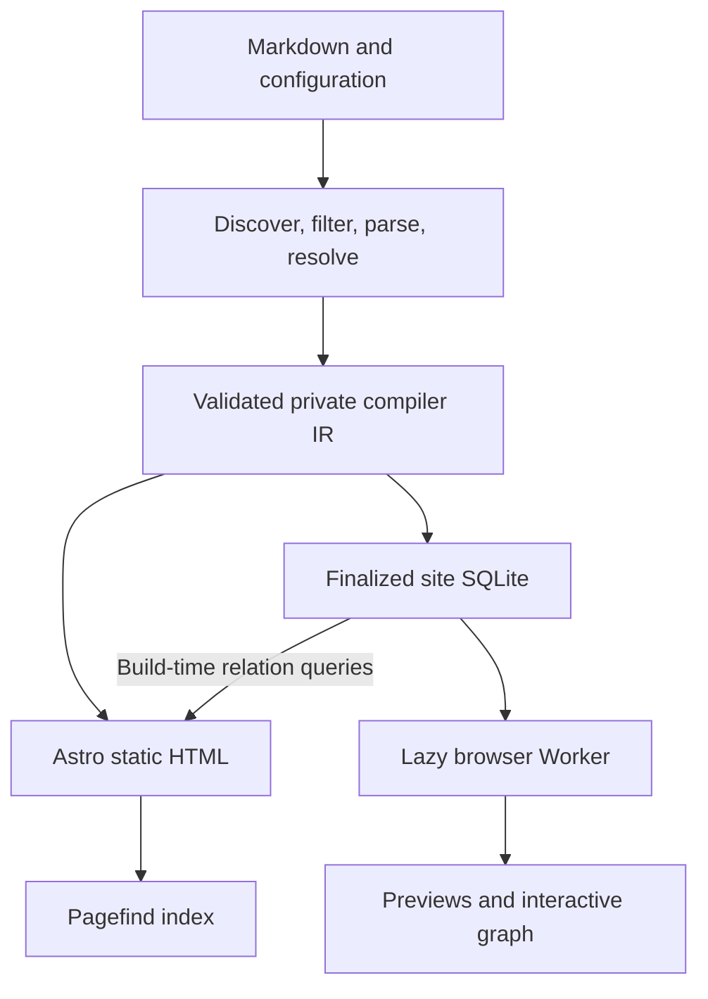

# Architecture and ownership

This is the long-term architecture. See the [baseline](README.md) for authority,
goal separation, and the explicit absence of backward-compatibility commitments.

## Product boundary

ANC is a reusable publisher, not the author's site. It accepts another user's
repository without requiring Obsidian, a generator fork, or a personal exporter.
Default publication and explicit exclusions remain the content selection model.
The product offers initialization, publication-set review, local builds, qualified
release builds, preview, packaged distribution, and a GitHub Action. These
capabilities do not freeze the current CLI/API or internal implementation shape.

The deployed product is static: Astro HTML/CSS, small client scripts, Pagefind,
and a downloadable SQLite snapshot queried by WASM. No application server,
privileged browser credentials, D1, OPFS, Service Worker, synchronization engine,
browser editor, analytics, or comments are part of this architecture. A graph query
does not justify adding a hosted database.

## Data flow

The IR is the producer/renderer boundary. It carries rewritten Markdown and
metadata needed by rendering, feeds, dates, language, collections, and routes.
It may be serialized privately while the CLI and Astro run in separate processes.
Keep serialization only while that process boundary actually needs it; it has no
compatibility entitlement. If an in-memory handoff removes the need, delete it.

Resolve link occurrences once. The resolved directed pairs are transient producer
data consumed by the DB builder. In the target, neither `outgoing` nor `backlinks`
is a long-lived field in serialized page entries. The renderer obtains relationship
results from SQLite; it does not resolve links again or maintain an inverse index.

An in-process query result, a batch used during one render, and accessible HTML are
allowed projections. They are not another independently maintained relation store.
Do not serialize those batches into a new public JSON file or corpus-sized JS object.

## Ownership of each capability

| Capability | Owner | Reason |
| --- | --- | --- |
| Publication selection and link resolution | Producer | Requires source and exclusion context unavailable to the browser |
| Article body, headings, footnotes, page language | IR and Astro | One content rendering path; effective language is also projected for browser labels |
| Preview title, excerpt, author-ordered aliases and effective note language | SQLite | Shared lookup model including mixed-language accessibility |
| Outgoing, backlinks, local/global graph | SQLite queries | One edge set and one relationship meaning |
| Tag identity and membership | Producer normalization, then SQLite | Tag routes and tag queries must agree |
| Full-text and alias search | Pagefind over generated HTML | A specialized search index, not relational duplication |
| Collections, dates, previous/next, feed metadata | Private IR and static output | Build consumers; no accepted browser collection query requires DB columns |
| Related-note suggestions | Build query results plus IR where necessary | Preserve existing shared-tag ranking and collection tie-break; do not store synthetic graph edges |
| Publication report and reviewed slug ledger | Existing private/repository workflow | Approval and diagnostics are not public graph data |
| Sitemap, feed, CSP and caching headers | Static emitters/host | Distinct discovery and hosting protocols |

The phrase “one public structured read model” refers to relational and preview
data. It does not forbid a feed, sitemap, Pagefind's own metadata, or a host config.
It does forbid a second corpus index with the same lookup or adjacency facts.

## Technology boundaries

- Keep Astro static rendering and the existing TypeScript/vanilla browser stack.
  This change does not introduce a component framework or generic storage adapter.
- Use built-in `node:sqlite` for build-time creation and reads. Keep one narrow set
  of SQL queries usable with the native build driver and browser WASM driver.
- Use the official `@sqlite.org/sqlite-wasm` package in a dedicated module Worker.
  Pin the exact selected version in the implementation and lockfile, after proving
  packaging, read-only import, and CSP compatibility. Do not copy historical version
  examples as a claim about what is currently compatible.
- Use the toolchain pinned in `.nvmrc` and the lockfile; align package engine
  declarations, CLI, CI, and adoption docs with the chosen runtime. There is no
  obligation to preserve a historical Node minimum or add a fallback SQLite driver.
- Ship required JS/WASM within the package and generated site. A built site needs
  same-origin HTTP asset requests, not a CDN library import or runtime data service.

Math and Mermaid retain their existing lazy modes and source fallback. Their CSP
requirements remain separate from SQLite. SQLite must not be used as a reason to
broaden script execution permissions or replace the article renderer.

## Why page bodies stay out of SQLite

Reading already has static HTML; full-text search already has Pagefind; preview
uses a bounded excerpt. Full source Markdown or rendered HTML in SQLite adds bulk
to every first database download without an additional required consumer. It also
creates an attractive second rendering path that would need to duplicate link,
heading, math, sanitization, and accessibility behavior.

Fossil's repository stores canonical artifacts in SQLite, whereas ANC rebuilds a
public projection from Markdown. Learn the separation between durable source and
query projections, not the incidental placement of Fossil's source bytes.
[Fossil's data model](https://fossil-scm.org/home/doc/trunk/www/fossil-is-not-relational.md)
explains that distinction.
