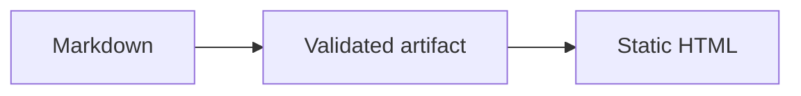

# Feature Showcase

This note carries rich frontmatter and lives in the `guides` collection. Its
aliases are searchable metadata, not alternate link targets.

## Prose and structure

Regular text can use **bold**, *emphasis*, ~~strikethrough~~, and `inline code`.
Prices such as $5 to $10 remain literal text.

| Surface | Generated at | JavaScript required |
|:--------|:-------------:|--------------------:|
| Article | build time | no |
| Search dialog | runtime | yes |
| Backlinks | build time | no |

- [x] Render a table
- [x] Render a task list
- [ ] Add only features with a measured need

> [!note] Build-time content
> The article remains readable when client-side scripts are disabled.

> An ordinary blockquote stays an ordinary blockquote.

## Code, math, and diagrams

```js
const answer = 41 + 1;
```

Inline math uses $$a^2 + b^2 = c^2$$, while display math gets its own block:

$$
\sum_{i=1}^{n} i = \frac{n(n + 1)}{2}
$$



## Footnotes and navigation

Footnotes render with localized, accessible backreferences.[^source]

Return to [[/start-here]], using a root-anchored wikilink.

[^source]: This is synthetic example content.
